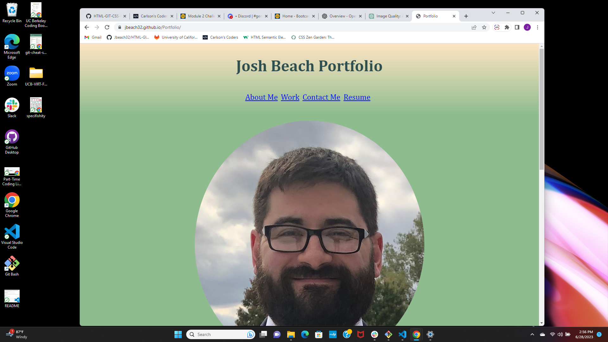
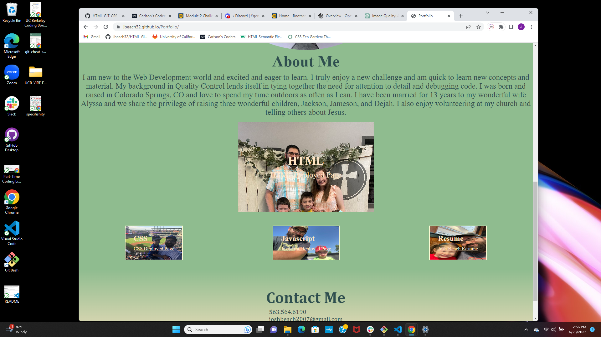
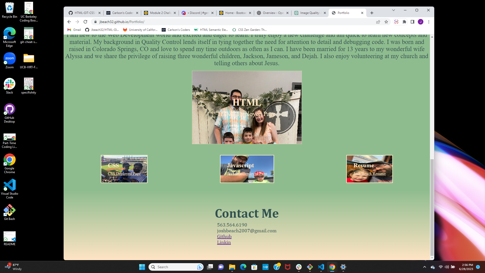

# Portfolio

## Josh Beach Portfolio Application

This webpage is a home page for my portfolio. Here you will find links about myself, my work, my resume, and how to contact me. 
There is also links to my deployed applications. HTML and CSS are functional, Javascript is coming soon! 

## Installation 

https://jbeach32.github.io/Portfolio/

## Usage

To use this webpage click on each of the link in the center of the header under the title. Hover over my images to find the links directing you to my deployed webpages or it will take you to different avenues to contact me.  

## Credits

N/A

## License

Please refer to the LICENSE in the repo. 

